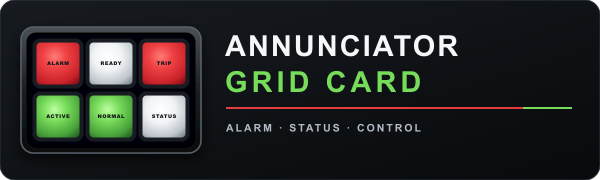

# Changelog

## [Unreleased]

- Added the Annunciator Grid Card visual identity, including compact icon, labeled annunciator logo, GitHub/social banner, documented brand palette, and the **ALARM · STATUS · CONTROL** brand line.
- Applied the branded presentation consistently across the README, current release notes, contributor guidance, security policy, and v1.1.0 documentation.
- Added automated checks for required brand assets, exact PNG dimensions, accessible SVG metadata, and documentation references.

## [1.1.0] - 2026-08-29

- Added schema v3 with conservative v1.0.2 migration defaults.
- Added six lamp shapes, optional panel surface overrides, and translucent illumination.
- Fixed translucent illumination being visually overridden by later lens/material rules, and made Retro Flicker visibly irregular while preserving reduced-motion behavior.
- Reworked Retro translucent lenses into a color-filled incandescent diffuser, retained distinct Plastic/Glass/Frosted/Smoked treatments, and prevented Retro Flicker from competing with active alert animations.
- Added one-step paired-lamp creation, automatic Pair IDs, and vertical/horizontal orientation.
- Added optional header tallies, editable Day/Week/Month/Year historical tally labels, and five ordered, independently labeled controls.
- Added fully opt-in header appearance controls for the header surface/border, separate title/tally/button colors, button normal/hover/border colors, font family/weight, font sizes, border widths, and button radius.
- Separated the outer panel/grid frame from lamp bezels, with compatibility, theme-bezel, and custom lamp-frame modes in the visual editor.
- Added None, Media Player, Script, and Advanced Action alarm outputs with SILENCE/new-alarm re-sound semantics.
- Added row/column spans with deterministic collision-free placement and pair compatibility.
- Added rule enable/disable and expanded interaction actions.
- Added differential, migration, malformed-config, state-machine, pair/layout, and scale tests.
- Fixed a visual-editor crash caused by interaction fields being evaluated in the panel renderer.
- Fixed a runtime grid initialization-order error and added mounted editor/runtime lifecycle plus undefined-identifier gates.
- Corrected shaped-lamp assemblies so Pill, Square, Circle, and Indicator Dot no longer retain a rectangular theme bezel; resized Indicator Dot and constrained shaped text for readability.
- Added theme-aware outer bezels that follow Pill, Square, Circle, and Indicator Dot geometry, including paired halves.
- Added Home Assistant's native media browser to Media player alarm output while retaining a collapsed manual URI/URL fallback.
- Standardized visual-editor multi-word labels on sentence case, clarified add/search controls, added panel-tab introductions, and grouped advanced media fields.
- Added global and per-spacer Compatibility, Blend, and Custom appearance modes, including independent fill, frame/bezel, border color, and border width. Blend removes the lens, bezel, glare, border, and shadow to create a true panel gap.
- Added a panel-wide Manual/Automatic ACK rearm default with per-lamp inheritance and explicit overrides; existing lamps retain their saved legacy Manual or Automatic behavior.
- Fixed Automatic ACK rearm clearing immediately on active steady/no-effect lamps by making rearm depend on the configured ON/OFF alert condition rather than the presence of an animation effect.
- Expanded ACK state-machine, malformed spacer, mounted runtime persistence, per-spacer rendering, editor lifecycle, and compact browser validation.
- Added explicit reversible None switches for the panel background/outer edge/grid frame, lamp frames/bezels and lens borders, header background/border/button fills/button borders, and Custom spacer fill/bezel/border layers.
- Kept lamp and spacer removal paths independent: hiding lamp bezels does not erase spacer styling, while each Custom spacer can inherit or remove only the layers it needs.
- Added up to 24 named, portable Appearance presets stored with the card. Presets snapshot only panel-wide visual choices and cannot replace entities, per-lamp overrides, layout, header controls, alarm output, acknowledgement settings, interactions, or rules.
- Added canonical global/per-lamp `lamp_brightness` profiles: Normal, Dim OFF, Dim ON, Dim non-alert, Dim all, and Custom OFF/ON/ALERT levels, plus per-lamp Inherit and pair-safe bulk application. Legacy inactive-lamp fields map exactly to Normal/Dim OFF without changing old visuals.
- Reorganized the long Panel Appearance editor into eight short, remembered sections: Appearance presets, Quick appearance, Panel & frames, Spacers, Header, Lamp lighting, ON/OFF colors, and Advanced colors. Lamp Appearance now uses Colors, Shape & size, Lens & light, and Pairing.
- Prevented Panel & frames from opening blank when Quick appearance disables its surfaces; it now names every hidden layer, retains controls for enabled layers, and offers a direct Edit visibility route.
- Simplified the visual-editor heading to the card version alone and removed the legacy-version suffix from the user-facing Panel default lamp-shape choice without changing its stored compatibility behavior.
- Added per-lamp Text, Icon only, and Icon + selected lines content modes with Home Assistant's icon picker, configurable icon size/color, independent Primary/Secondary/Tertiary visibility, entity-icon and domain fallbacks, and paired-half independence.
- Fixed text-only lamp labels being pushed below center by an invisible icon placeholder; hidden icons now occupy zero layout space and blank display lines no longer reserve margins.
- Added Condensed/System/Monospace/Serif/Custom CSS font choices at panel-lamp, per-lamp, and header scope, plus live font specimens and a stronger Arial Narrow/Roboto Condensed/Liberation Sans Narrow fallback stack. Existing configurations retain the original lamp and header font behavior unless a new choice is selected.
- Added first-class Derived lamps with no primary entity, an explicit OFF/ON base state, custom text/icon content, and external-entity Conditional Rules. Derived lamps participate safely in pairing, grouping, ACK persistence/rearm, tallies/history, alarm output, spans, dimming, Lamp Test, interactions, and diagnostics.
- Added independent opt-in corner radii for the complete panel, outer grid frame, and header; moved the existing lamp bezel/lens corner controls beside the other frame controls so surface geometry is configured in one place.
- Added opt-in rolling ALARM DAY/WEEK/MONTH/YEAR arrival tallies with bounded per-browser persistence, stable-identity duplicate suppression, automatic expiry refresh, and a dedicated history reset that does not alter ACK or entity state.
- Fixed Add paired lamp creating two spacers by persisting unfinished lamp identity until both entities are selected; also corrected Add lamp, preserved automatic Pair IDs/adjacency/ACK slots, and kept legacy blank cells as spacers.
- Fixed fallback card sizing omitting a header that contained only tallies or only newer v1.1 header controls.
- Added mounted computed-style checks for true transparent/no-border/no-shadow results, real-browser switch mutation, desktop/compact no-overflow checks, and migration hardening for malformed None values.
- Split lamp editing into a default **Quick setup** workflow and an opt-in **Full editor** with all specialist tabs; changing editor mode is transient and does not rewrite card configuration.
- Added exact, case-sensitive existing-group suggestions, a group summary, and automatic group synchronization between valid paired halves while retaining free entry for new group names.
- Added transient pair-safe bulk selection for Group, lamp font, shape, style, lens, color behavior, icon size, brightness profile, ACK rearm, alarm-output participation, and saved lamp appearance styles. Each Apply operation creates one undo point and leaves mixed values untouched until explicitly applied.
- Added up to 24 named `lamp_appearance_presets`. These portable presets contain only normalized lamp visual fields and deliberately exclude entity/source identity, text and icon identity, severity, alert behavior, ACK, rules, actions, groups, pairs, and layout.
- Added a read-only live Conditional Rule trace that uses the runtime rule evaluator, identifies the first winning rule, and reports the runtime's exact match/skip reasons without mutating configuration or calling services.
- Added a historical-tally source choice: bounded local-browser observations remain the compatibility default, while optional Home Assistant entity sources provide shared Day/Week/Month/Year values. Blank/missing, unknown, unavailable, nonnumeric, non-finite, and negative entity values render as `—`; entity mode skips local history tracking and reset.
- Added optional `alarm_output.silence_script` for Script mode. After Start script succeeds, the reversal script is started when SILENCE is selected, the active audible-alarm set becomes empty, the applied output configuration changes, or the card disconnects; generic `silence_action` remains the fallback when no Silence script is configured.
- Documented that browser-local history cannot backfill dashboard downtime, browser-driven alarm output requires an open connected client and may run once per open card, and only `input_text` ACK storage is shared between clients.
- Added a non-mutating **OFF · ON · ALERT** brightness preview and made the canonical brightness object available to visual-only lamp presets and explicit per-lamp/bulk **Brightness** changes.
- Fixed brightness precedence so INOP and Lamp Test are always full, active alarm/change-alert channels use Alert brightness even after ACK, and ordinary lamps then use resolved ON or OFF brightness.
- Fixed Derived-lamp change alerts to compare the resolved final lamp state, so an external rule changing Force ON/OFF can trigger a change alert without repeated alerts from unchanged rerenders.
- Fixed Lamp Test consistency by capturing one test-active snapshot for the complete render instead of allowing its timer to expire between model evaluation and brightness resolution.
- Hardened canonical brightness parsing so malformed/profile-less objects fall back to legacy aliases and boolean/array/object/null/blank/non-finite levels use safe field defaults rather than numeric coercion.
- Fixed sequential OFF/ON/ALERT editor changes so later fields preserve earlier edits and refresh the passive preview immediately.
- Prevented Derived base/rule configuration edits from creating false change alerts while retaining real dependency transitions and any already-active alert.
- Preserved legacy-only lamp preset semantics by omitting/removing canonical brightness and resolving the preset's alias at the receiving panel's current dim level.
- Added per-line **ON / OFF labels** for Primary, Secondary, and Tertiary with independent ON, OFF, Unavailable, and Unknown text. Selection follows the final logical state after invert, rule Force ON/OFF, and Lamp Test.
- Added up to 24 ordered **Dynamic text rules** per display line. First enabled match wins across lamp ON/OFF, availability, exact/string/numeric state, ACK, and active/normal alarm conditions; a separate fallback is used only when no rule matches.
- Added **Icon color** modes for Follow lamp text, One custom color, and Separate ON/OFF colors. Existing `icon_color_enabled` configurations retain their prior single-color result, and unavailable icons keep the unavailable text color.
- Preserved exact v1.0.2 evaluator structure for old display modes by emitting dynamic metadata only when a new state-aware mode is explicitly selected.
- Added focused malformed-rule, migration, first-match, final-state, preset, editor-mutation, mounted-runtime, and desktop/mobile browser validation for dynamic text and state icon colors.
- Clarified state-aware text conditions as **ACK stored**, **No ACK stored**, **Main alert active**, and **Main alert inactive**, with exact visual-alert semantics explained in the editor.
- Added concise **Paired**, **Span**, **Dynamic**, **Audible**, and **Override** badges to the physical-cell navigator so specialist configuration is visible without opening a lamp.
- Added read-only current-setting summaries to the Display and Behavior pages.
- Added an undoable **Copy display settings** action between lamps. It copies content/icon/font/text modes, dynamic text rules, templates, and value formatting while preserving entity/name identity, behavior, appearance, pairing, spans, actions, and ACK policy.
- Added non-blocking WCAG-style contrast warnings for explicit lamp, global, and header text/icon color combinations. Theme-dependent or unparseable CSS colors are left alone rather than guessed.
- Added adjacent **Use panel default** resets for per-lamp font, shape, style, lens, brightness, and ACK policy, plus safe resets for icon-color and spacer appearance overrides.
- Added an opt-in paired **Split pill** shape for vertical and horizontal pairs. It renders one continuous capsule bezel with a center divider while both halves keep independent state, color, text, icon, ACK, output, and interaction behavior; existing pairs remain Independent lamps.
- Fixed Auto Fit and card-height calculations for row/column spans, mixed-span collisions, paired maximum spans, and compact grouped rows.
- Fixed hand-written `source_mode: derived` lamps being misclassified as spacers when `cell_type` was omitted.
- Restored responsive observation when Home Assistant detaches and reuses an existing runtime card or visual editor element.
- Hardened Perform Action, Navigate, and Open URL handling with exact `domain.service` validation, separate Home Assistant service targets, safe local navigation, executable-URL rejection, accurate accessibility labels, non-clickable incomplete actions, and correct Advanced Action start state.
- Fixed orphan-pair repair retaining stale Split pill metadata, duplicate resource evaluation duplicating card-picker metadata, Lamp Test timer cleanup, and malformed `.github/FUNDING.yml` packaging structure.
- Added final whole-code validation for duplicate/missing methods and keys, mounted 360-lamp rendering, actual browser span/collision/group geometry, runtime/editor reconnects, interaction safety, and source/stage/extraction package parity.
- Fixed Quick setup brightness profiles hiding their Dim level or Custom OFF/ON/Alert percentages and removing the read-only reference lenses after a selection change.
- Prevented reflected, incomplete, same-value, and detached visual-editor selector events from causing redundant mutations or render loops across dropdown, entity, and icon selectors.
- Coalesced high-frequency native color-picker input and rate-limited Home Assistant configuration reflection while dragging, while still flushing the exact final color when the picker closes.
- Closed native edit transactions before structural editor rerenders so switching modes immediately after typing cannot leave the visual editor locked in an active-edit state.

## [1.0.2] - 2026-08-23

### Added
- Cross-entity Conditional Rules with external dependency tracking.
- Force OFF rule action alongside existing Force ON behavior.
- Configurable per-lamp Tap / short press, Double tap, and Long press actions.
- More Info, Toggle, Turn On, Turn Off, Acknowledge, Clear ACK, and None interaction actions.
- Optional alternate target entities for entity-based lamp interactions.
- Independent panel header **ACK ALL** and **CLEAR ACK** buttons with separate show/hide controls.
- Standard ON/OFF, Severity, and Custom ON/OFF color behaviors for new/converted lamps.
- Individual enable/disable switches for global color overrides.
- Expanded repository runtime regression coverage.

### Changed
- New lamps default to Status-style Standard ON/OFF behavior with green ON, neutral OFF, and no alert effect.
- Simplified the normal lamp color editor by replacing redundant ON Color / ON Window presentation with symmetrical ON/OFF color behavior.
- Frame and Panel global colors are explicit overrides, allowing Classic, Avionics, and Neon themes to provide their own surfaces when disabled.
- Classic, Avionics, and Neon themes are more visibly distinct.
- Plastic, Glass, Frosted, and Smoked lens materials are more visually distinct in Modern and Retro styles.
- Rules editor now explains when severity affects color versus when an explicit rule ON color should be used.
- Standardized panel-wide acknowledgement labels as **ACK ALL** and **CLEAR ACK**.
- Expanded README, complete user guide, configuration reference, troubleshooting, migration, validation notes, and examples for v1.0.2.

### Fixed / hardened
- Fixed standalone ON lamps failing to use the resolved active color while equivalent paired lamps did.
- Preserved legacy color precedence, including legacy ON Window priority and STATUS fallback for partial hand-written severity palettes.
- Prevented incomplete Another Entity rules from silently evaluating the lamp entity.
- Prevented incomplete alternate interaction targets from silently operating the lamp entity.
- Prevented double tap and long press gestures from also firing Tap actions.
- Fixed very-long-hold and touch no-synthetic-click suppression edge cases.
- Prevented diagnostics/info controls from bubbling gestures to a lamp.
- Prevented lens imperfection variation from overwriting lens-material glare strength.
- Hardened malformed decimal precision values against `toFixed()` range exceptions.
- Fixed editor/runtime color-default drift and the seven-tab desktop layout.
- Fixed spacer rendering references left behind by the global-color refactor.
- Preserved old single-header ACK behavior, including the historical CLEAR ACK-only default for minimal pre-v1.0.2 configs.
- Changed ACK ALL so it acknowledges only currently active alert channels instead of pre-ACKing inactive lamps.

## [1.0.1] - 2026-08-21

### Changed
- Updated the README and documentation presented through HACS.
- Improved release/version presentation to avoid stale hard-coded release information.
- Prepared repository metadata and documentation for HACS default-catalog submission.

### Runtime
- No functional annunciator behavior changes from v1.0.0.
- Existing configurations remain compatible.

## [1.0.0] - 2026-08-20

### Added

- Full visual editor with responsive, searchable, paginated physical-cell navigator.
- Lamp intents: Alarm, Status, Sensor, Custom.
- Truthy, state-list, string, and numeric condition evaluation.
- Value conversion/formatting pipeline including C/F conversion, scale, offset, rounding, units, prefix, and suffix.
- Conditional Rules with ordered first-match priority, severity/color/effect overrides, Force ON, duplication, movement, deletion, and Undo.
- Attention effects: Blink, Pulse, Wave, Throb, Heartbeat, Flash.
- Separate state/value-change alert policy with timed or until-ACK operation.
- Manual and automatic acknowledgement rearm.
- Adaptive compact persistent ACK storage with legacy migration and browser-local fallback.
- Paired TOP/BOTTOM lamps with atomic physical-cell movement and optional linked ACK.
- Group headers, group ACK/Clear, alerting-only ACK, and optional change-alert inclusion.
- Modern/Retro lamps, lens styles, severity appearance maps, per-lamp colors, retro warm-up and subtle flicker.
- Auto Fit, Fixed Size, and Horizontal Scroll runtime sizing.
- Dynamic Home Assistant Masonry and Sections sizing.
- Operator and Presentation panel modes.
- Lamp Test helper with Illuminate Only and Full Alert Test modes.
- Diagnostics/history overlay and copyable diagnostic package.
- Configuration schema v2 validation and safe repair for UIDs, ACK slots, and malformed pairs.
- Undo for structural editor actions.
- Keyboard/pointer acknowledgement and reduced-motion support.

### Fixed / hardened before 1.0

- Text, number, and color inputs retain focus through Home Assistant reflected config updates.
- Native color picker remains active during delayed/multiple changes.
- Compact panels no longer reserve invisible configured columns.
- ACK header follows occupied panel width; stray right-side sizing artifacts removed.
- Celsius/Fahrenheit values and automatic units stay consistent.
- `scale: 0` is valid.
- Border-emphasis and all animation-speed controls are actually applied.
- Cell padding, font weight, frame color, corner radius, rows/minimum height, and paired-cell styling are consistently applied.
- Persistent ACK has immediate optimistic visual feedback and safe failed-write fallback.
- ACK actions are idempotent; Clear ACK is a separate operation.
- Group Include Change setting is honored.
- Lamp Test cannot accidentally mutate ACK state and can test unavailable source windows.
- Change-alert state is cleared when the feature is disabled and config changes cannot fake source-state changes.
- ACK slots are monotonic and are not rewound by Undo.
- Pair physical position is consistently defined by TOP, including legacy/manual configurations.
- Auto Fit has no arbitrary minimum scale that can reintroduce clipping.
