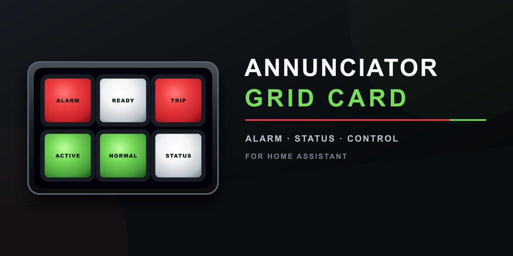
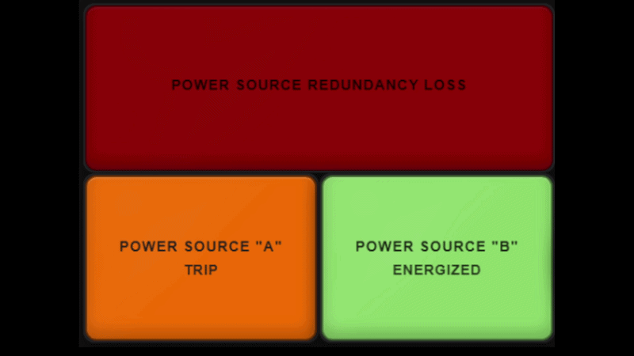

# Annunciator Grid Card

**ALARM · STATUS · CONTROL**

[](https://buymeacoffee.com/fallenhero)

[](https://github.com/Fallen-Hero/annunciator-grid-card/releases/latest)
[](https://www.hacs.xyz/)
[](https://www.home-assistant.io/)
[](LICENSE)

An industrial alarm, status, and control panel card for Home Assistant. It can be as simple as a green-when-ON / neutral-when-OFF indicator, or as advanced as a multi-severity alarm panel with conditional rules, acknowledgement, paired lamps, groups, change alerts, cross-entity logic, custom interactions, diagnostics, and persistent ACK storage.

> **Safety notice:** This is a dashboard/monitoring component. It is not a certified life-safety, fire-alarm, process-safety, protective-relay, emergency-shutdown, or safety-instrumented-system component. Do not use it as the sole means of protecting people, equipment, or property.

## Preview



*A wide alarm lamp above independent trip and energized status lamps. Layouts, labels, colors, shapes, illumination, behavior, and interactions are configurable.*

## What's new in v1.1.0

- **More visual control:** six lamp shapes, shape-following borders and bezels, independent panel/header/lamp/spacer surfaces, rounded corners, translucent illumination, reusable appearance presets, custom fonts, and OFF/ON/ALERT brightness profiles.
- **Flexible content:** Text, Icon only, or Icon + selected lines; state-aware labels and dynamic text rules; configurable icon size and separate ON/OFF icon colors; and entityless Derived lamps driven by Home Assistant entities.
- **Stronger layouts:** one-step paired-lamp creation, automatic Pair IDs, vertical or horizontal orientation, optional Split pill geometry, and collision-safe row/column spans.
- **Complete alarm header:** optional live and historical tallies plus independently visible and relabelable ACKNOWLEDGE, SILENCE, RESET, LAMP TEST, and CLEAR ACKNOWLEDGED controls.
- **Practical alarm output:** None, Media player, Script, or Advanced action modes, including Home Assistant's media browser, proper SILENCE behavior, and re-sound when a new alarm arrives.
- **Cleaner visual editor:** Quick setup and Full editor workflows, compact appearance sections, group suggestions, pair-safe bulk editing, navigator badges, setting summaries, display-setting copying, contrast warnings, inheritance resets, and live rule tracing.
- **Runtime hardening:** corrected ACK rearm, alarm-output cleanup, responsive editor behavior, shaped rendering, Retro alert composition, large-panel sizing, and malformed-configuration handling.

Existing v1.0.2 configurations retain their established visuals and behavior unless a new v1.1 option is deliberately enabled. Review the [migration guide](docs/MIGRATION.md) before updating an important dashboard, and see the [changelog](CHANGELOG.md) for the complete release history.

## Core capabilities

- Full Home Assistant visual editor — normal use does not require YAML.
- Simple ON/OFF indication out of the box.
- Alarm, Status, Sensor, and Custom lamp intents.
- Standard ON/OFF, Severity, Custom ON/OFF, and legacy-compatible color behavior.
- Truthy, state-list, string-match, and numeric-threshold conditions.
- Optional TRIP / ALARM / WARN / STATUS severity system.
- Conditional Rules with ordered first-match priority, external entity sources, severity/color/effect overrides, Force ON, and Force OFF.
- Blink, Pulse, Wave, Throb, Heartbeat, Flash, or steady indication.
- Manual or automatic ACK rearm.
- Panel-wide ACK rearm default with per-lamp Use panel default, Manual, and Automatic choices.
- Global and per-spacer Compatibility, Blend, and Custom fill/frame/border appearance.
- Up to 24 named panel appearance presets and 24 named per-lamp appearance presets stored with the card. Lamp presets contain only visual fields and never replace identity, text/icon choice, alarm severity, rules, actions, groups, pairs, or spans.
- Global and per-lamp brightness profiles for Normal, Dim OFF, Dim ON, Dim non-alert, Dim all, or independent custom OFF/ON/ALERT levels. INOP and Lamp Test always use full brightness; alert and change-alert brightness remains independent of ACK.
- Five independently configurable header controls in annunciator order: **ACKNOWLEDGE**, **SILENCE**, **RESET**, **LAMP TEST**, and **CLEAR ACKNOWLEDGED**.
- Local-browser or compact persistent `input_text` ACK storage.
- Separate state/value-change alerts with timed or until-ACK behavior.
- Per-lamp Tap, Double tap, and Long press actions with safe gesture arbitration.
- Optional alternate target entities for lamp controls.
- Up to three display lines or lightweight card-side templates.
- Per-line ON/OFF/Unavailable/Unknown labels or up to 24 ordered dynamic text rules, with first-match state, string, numeric, ACK, availability, and alarm conditions.
- Icon colors that follow lamp text, use one custom color, or use separate final-state ON/OFF colors.
- Celsius/Fahrenheit conversion, scale, offset, decimals, rounding, units, prefix, and suffix.
- Paired TOP/BOTTOM lamps that behave as one physical panel cell.
- Group headers and group ACK/Clear controls.
- Exact existing-group suggestions, paired-half group synchronization, and pair-safe bulk editing for common lamp fields.
- A live, read-only Conditional Rule trace that explains matches, skips, source problems, and the first winning rule without changing the card.
- Historical alarm totals from either this browser's observed alarm arrivals or user-supplied Home Assistant sensor entities for a shared authoritative display.
- Auto Fit, Fixed Size, and Horizontal Scroll panel sizing.
- Modern/Retro lamp styles and Plastic/Glass/Frosted/Smoked lens materials.
- Classic, Avionics, and Neon panel themes.
- Operator and Presentation modes.
- Lamp Test helper with steady-illumination or full-alert test modes.
- Searchable, paginated physical-cell navigator.
- Optional vertical or horizontal **Split pill** paired geometry with one continuous capsule and independently operating halves.
- Configuration validation/repair, Undo, diagnostics overlay, and copyable support package.
- Dynamic Masonry/Sections sizing and reduced-motion support.

## Installation

### HACS custom repository

Until the repository is included in the default HACS catalog:

1. Open **HACS** in Home Assistant.
2. Open the HACS menu and choose **Custom repositories**.
3. Add `https://github.com/Fallen-Hero/annunciator-grid-card`.
4. Select **Dashboard** as the category.
5. Open **Annunciator Grid Card** and choose **Download**.
6. Refresh the browser after installation or update.

After the repository is accepted into the default HACS catalog, search for **Annunciator Grid Card** directly in HACS.

### Manual installation

1. Download `annunciator-grid-card.js` from the latest GitHub Release.
2. Copy it to:

   ```text
   <config>/www/annunciator-grid-card.js
   ```

3. Add it as a Lovelace resource of type **JavaScript Module**:

   ```yaml
   resources:
     - url: /local/annunciator-grid-card.js
       type: module
   ```

4. Reload Home Assistant and hard-refresh the browser. Confirm that the visual editor shows `v1.1.0`.

### Updating from v1.0.2

Keep a dashboard backup, update the card through HACS or replace the manual JavaScript file, then hard-refresh every browser that displays the panel. Existing v1.0.2 configurations remain on compatibility defaults until a new v1.1 option is selected.

## 60-second quick start

1. Add **Annunciator Grid Card** from the dashboard card picker.
2. Choose **+ Lamp**.
3. Select a Home Assistant entity.
4. Leave **Color behavior = Standard ON/OFF**.
5. Leave **Alert = None** unless you want an alarm effect.
6. Save the dashboard.

For a new lamp, the simple defaults are:

| Condition | Default appearance |
| --- | --- |
| Lamp ON / active | Green |
| Lamp OFF / inactive | Neutral / light |
| Unavailable / unknown | Gray / `INOP` |

The card's ON/OFF condition is configurable, so “ON” means the lamp condition evaluated true — not necessarily that the entity literally has the state `on`.

## Color behavior

Each lamp can use one of the following models:

- **Standard ON/OFF** — simplest mode. Uses the global ON and OFF colors and ignores severity for normal color selection.
- **Severity** — active color comes from STATUS, WARN, ALARM, or TRIP; inactive color still uses OFF.
- **Custom ON/OFF** — this lamp gets its own ON/OFF and optional text/unavailable colors.
- **Legacy compatibility** — shown only for existing v1.x lamps that still need the old color precedence.

Global colors are optional overrides. Frame and Panel overrides are disabled by default on new cards so the selected panel theme can visibly control those surfaces. In v1.1, **Panel settings → Appearance → Lamp frame source** can make lamp bezels follow the outer frame, retain the theme bezel, or use a dedicated custom color. **Appearance presets** stores reusable panel-wide looks in the card, while **Quick appearance** independently removes the panel background/edge/frame, lamp bezels/lens borders, header background/edge, and header button fills/edges without deleting saved colors. **Lamp lighting** contains the panel **Brightness profile**, its levels, and the live **OFF · ON · ALERT** preview; individual lamps can inherit or override that profile.

## Configurable lamp interactions

Every populated lamp has independently configurable actions for:

| Gesture | Default | Available actions |
| --- | --- | --- |
| Tap / short press | More Info | More Info, Toggle, Turn On, Turn Off, Acknowledge, Clear ACK, Perform Action, Navigate, Open URL, None |
| Double tap | Acknowledge | Same choices |
| Long press | Acknowledge | Same choices |

For More Info / Toggle / Turn On / Turn Off, the target can be **This lamp entity** or **Another entity**. This makes it possible to display one entity while controlling another.

Perform Action accepts a valid Home Assistant `domain.service`; optional service data and a service target can be supplied in YAML. Navigate accepts only a local Home Assistant path. Open URL rejects executable URL schemes. Missing or unsafe action details are reported by the configuration check and do not make the lamp appear clickable.

Example: display `binary_sensor.garage_door_open`, but make Tap operate `cover.garage_door`.

Gesture arbitration ensures one physical gesture executes one configured action. A double tap does not also fire Tap, and a long press does not also fire Tap.

Keyboard mapping when a lamp is focused:

- **Enter** → Tap action
- **Space** → Double-tap action
- **Shift+Space** → Long-press action

With the defaults, Space continues to acknowledge an active alert.

## Header alarm controls

The header can show five controls in a fixed annunciator order:

- **ACKNOWLEDGE** — acknowledges only alert channels that are currently active. It does not change Home Assistant entity states or pre-acknowledge inactive lamps.
- **SILENCE** — stops the current panel alarm output without acknowledging the alarm. A newly arriving participating alarm can sound again.
- **RESET** — rearms cleared latched alarm state; it does not change a source entity.
- **LAMP TEST** — toggles the configured helper or runs the built-in three-second test.
- **CLEAR ACKNOWLEDGED** — removes stored acknowledgement so an active condition can indicate again.

Each control can be shown or hidden independently and can use a custom label under **Panel settings → Acknowledgement → Header controls**. Legacy **ACK ALL** and **CLEAR ACK** configurations remain supported and retain their saved visibility and labels.

## Optional helpers

The card works without helpers. For a shared/persistent operator panel, these are useful:

```yaml
input_text:
  annunciator_ack_map:
    name: Annunciator ACK Map
    max: 255

input_boolean:
  annunciator_lamp_test:
    name: Annunciator Lamp Test
```

- Configure the text helper under **Panel settings → Acknowledgement → ACK storage**.
- Configure the toggle under **Panel settings → Advanced → Lamp test entity**.

Local ACK storage is per browser/device. `input_text` storage is useful when multiple Home Assistant clients should share ACK state.

Local historical tallies are also browser/device data. They count only alarm arrivals observed while a card is running and cannot reconstruct time when every dashboard was closed. For shared or continuously maintained totals, open **Historical alarm tallies**, set **Tally source** to **Home Assistant entities**, and supply sensors whose states contain the desired Day/Week/Month/Year values. The card reads those values; it does not create, update, clear, or backfill the sensors. A missing, unknown, unavailable, nonnumeric, non-finite, or negative source is shown as `—` rather than as a false zero.

Alarm output is initiated by the browser displaying the card, not by a Home Assistant server automation. The dashboard must be open, connected, and authorized to call the selected service. Avoid enabling the same audible output on several simultaneously open dashboards unless duplicate calls are acceptable. For a server-owned or safety-critical notification, use Home Assistant automations in addition to the card.

## Basic YAML example

Most users should use the visual editor, but the card can also be configured in YAML:

```yaml
type: custom:annunciator-grid-card
title: House Status
header_controls:
  acknowledge:
    enabled: true
  clear_acknowledged:
    enabled: true
entities:
  - entity: light.porch
    lamp_type: status
    color_behavior: standard
    eval_mode: toggle
    alert_style: none
    primary_mode: name
    secondary_mode: state
    tap_action: toggle
    double_tap_action: ack
    hold_action: more_info
```

See the [examples](examples/) directory for additional configurations.

## Advanced alarm example

```yaml
type: custom:annunciator-grid-card
panel_id: main_panel
columns: 4
header_controls:
  acknowledge:
    enabled: true
  clear_acknowledged:
    enabled: true
entities:
  - entity: binary_sensor.boiler_trip
    lamp_type: alarm
    color_behavior: severity
    severity: trip
    eval_mode: toggle
    alert_style: blink
    alert_when: on
    ack_rearm: auto
    primary_mode: name
    secondary_mode: state
```

## Conditional Rules

Conditional Rules are evaluated from top to bottom. **First matching rule wins.** A rule can evaluate either the lamp's own entity or another Home Assistant entity and can change:

- severity;
- alert effect;
- ON color;
- lamp state: Inherit / Force ON / Force OFF.

Cross-entity numeric rules compare against the external source entity's raw numeric state. The lamp's own scale/offset/conversion does not alter another entity's numeric value.

In **Full editor → Rules**, the live trace evaluates the current Home Assistant states with the same ordered first-match logic as the lamp. It identifies the first winner and explains disabled, incomplete, unavailable, nonnumeric, nonmatching, and lower-priority rules. Refreshing or reading the trace never changes a lamp, calls a service, or saves configuration.

## Templates and Home Assistant Jinja

The card supports lightweight display substitutions such as:

```text
{{name}}
{{state}}
{{value}}
{{unit}}
{{acked}}
{{severity}}
{{attributes.xxx}}
```

These are **card-side substitutions, not Home Assistant Jinja templates**. If you need full Home Assistant Jinja/template logic, create a Home Assistant Template Sensor or Template Binary Sensor and use that entity in the card.

## Compatibility notes

v1.1.0 contains compatibility paths for existing configurations.

- Existing lamps without `color_behavior` remain on **Legacy compatibility** until you explicitly choose Standard, Severity, or Custom.
- Legacy ON Window settings remain readable even though the redundant ON Window control is no longer exposed in the normal editor.
- v1.0.2 ACK ALL/CLEAR ACK settings and older single-button ACK settings are migrated into the five-control header model without changing their saved visibility or labels.
- Existing ACK identities/slots are retained and repaired safely when possible.
- New lamps use the simpler Standard ON/OFF defaults.

As with any dashboard component update, keep a Home Assistant/dashboard backup before making major configuration changes.

## Documentation

- [Complete User Guide](docs/USER_GUIDE.md)
- [Configuration Reference](docs/CONFIG_REFERENCE.md)
- [Troubleshooting](docs/TROUBLESHOOTING.md)
- [Migration / compatibility](docs/MIGRATION.md)
- [Validation notes](docs/VALIDATION.md)
- [v1.1.0 validation record](docs/V1.1.0-VALIDATION-RECORD.md)
- [Brand assets and usage](docs/BRANDING.md)
- [Examples](examples/)
- [Shared historical-tally entity example](examples/shared-historical-tallies.yaml)
- [Script alarm-output and Silence script example](examples/script-alarm-output.yaml)
- [Changelog](CHANGELOG.md)

## Support / bug reports

When reporting a bug, please include:

1. Card version.
2. Home Assistant version.
3. Browser/device.
4. Whether the card was installed through HACS or a manual release download.
5. Relevant lamp/panel configuration.
6. Browser-console errors.
7. The card's **Copy diagnostic package** output when possible.
8. A screenshot or short screen recording when the issue is visual or gesture-related.

## ☕ Support the project

If you enjoy Annunciator Grid Card and would like to support its continued development, you can buy me a coffee:

[](https://buymeacoffee.com/fallenhero)

Support is completely optional. Thank you for using and supporting the project.

## License

MIT — see [LICENSE](LICENSE).
