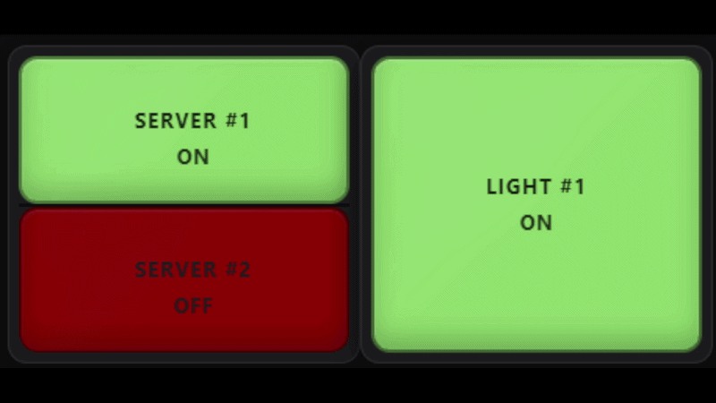

# Annunciator Grid Card

[](https://buymeacoffee.com/fallenhero)

[](https://github.com/Fallen-Hero/annunciator-grid-card/releases/latest)
[](https://www.hacs.xyz/)
[](https://www.home-assistant.io/)
[](LICENSE)

A highly configurable industrial-style annunciator panel for Home Assistant. It can be as simple as a green-when-ON / neutral-when-OFF indicator, or as advanced as a multi-severity alarm panel with conditional rules, acknowledgement, paired lamps, groups, change alerts, cross-entity logic, custom interactions, diagnostics, and persistent ACK storage.

> **Safety notice:** This is a dashboard/monitoring component. It is not a certified life-safety, fire-alarm, process-safety, protective-relay, emergency-shutdown, or safety-instrumented-system component. Do not use it as the sole means of protecting people, equipment, or property.


## Live example

A paired TOP/BOTTOM lamp alongside a standalone lamp using the card's Standard ON/OFF color behavior.



*Paired and standalone lamps can use independent entities, colors, conditions, alerts, acknowledgement behavior, and interactions.*

## What's new in v1.0.2

v1.0.2 is a community-feedback and stabilization release with a strong focus on making the card easier for normal Home Assistant use while retaining the advanced annunciator features.

- **Simple Standard ON/OFF colors** for new lamps: green ON, neutral OFF, no alert by default.
- Optional **Severity** and **Custom ON/OFF** color modes.
- Independently enable/disable global color overrides.
- Improved **Classic, Avionics, and Neon** panel themes.
- More visibly distinct **Plastic, Glass, Frosted, and Smoked** lens materials in Modern and Retro styles.
- Cross-entity Conditional Rules using **This lamp entity** or **Another entity**.
- **Force OFF** rule action in addition to Force ON.
- Configurable **Tap / short press, Double tap, and Long press** actions per lamp.
- Actions: More Info, Toggle, Turn On, Turn Off, Acknowledge, Clear ACK, or None.
- Optional alternate target entities for More Info/control actions.
- New independent panel header controls: **ACK ALL** and **CLEAR ACK**.
- Standalone/paired lamp color consistency fixes and substantial runtime hardening.
- Expanded automated regression, fuzz, differential, and browser validation.

See [CHANGELOG.md](CHANGELOG.md) for the full release history.

## Highlights

- Full Home Assistant visual editor — normal use does not require YAML.
- Simple ON/OFF indication out of the box.
- Alarm, Status, Sensor, and Custom lamp intents.
- Standard ON/OFF, Severity, Custom ON/OFF, and legacy-compatible color behavior.
- Truthy, state-list, string-match, and numeric-threshold conditions.
- Optional TRIP / ALARM / WARN / STATUS severity system.
- Conditional Rules with ordered first-match priority, external entity sources, severity/color/effect overrides, Force ON, and Force OFF.
- Blink, Pulse, Wave, Throb, Heartbeat, Flash, or steady indication.
- Manual or automatic ACK rearm.
- Independent **ACK ALL** and **CLEAR ACK** panel header buttons.
- Local-browser or compact persistent `input_text` ACK storage.
- Separate state/value-change alerts with timed or until-ACK behavior.
- Per-lamp Tap, Double tap, and Long press actions with safe gesture arbitration.
- Optional alternate target entities for lamp controls.
- Up to three display lines or lightweight card-side templates.
- Celsius/Fahrenheit conversion, scale, offset, decimals, rounding, units, prefix, and suffix.
- Paired TOP/BOTTOM lamps that behave as one physical panel cell.
- Group headers and group ACK/Clear controls.
- Auto Fit, Fixed Size, and Horizontal Scroll panel sizing.
- Modern/Retro lamp styles and Plastic/Glass/Frosted/Smoked lens materials.
- Classic, Avionics, and Neon panel themes.
- Operator and Presentation modes.
- Lamp Test helper with steady-illumination or full-alert test modes.
- Searchable, paginated physical-cell navigator.
- Configuration validation/repair, Undo, diagnostics overlay, and copyable support package.
- Dynamic Masonry/Sections sizing and reduced-motion support.

## Installation

### HACS — custom repository

Until the repository is included in the default HACS catalog:

1. Open **HACS** in Home Assistant.
2. Open the HACS menu and choose **Custom repositories**.
3. Add `https://github.com/Fallen-Hero/annunciator-grid-card`.
4. Select **Dashboard** as the category.
5. Open **Annunciator Grid Card** and choose **Download**.
6. Refresh the browser after installation or update.

After the repository is accepted into the default HACS catalog, search for **Annunciator Grid Card** directly in HACS.

### Manual installation

1. Download `annunciator-grid-card.js` from the latest GitHub Release.
2. Copy it to:

   ```text
   <config>/www/annunciator-grid-card.js
   ```

3. Add it as a Lovelace resource of type **JavaScript Module**:

   ```yaml
   resources:
     - url: /local/annunciator-grid-card.js
       type: module
   ```

4. Refresh Home Assistant. If the old card is still cached, hard-refresh the browser.

## 60-second quick start

1. Add **Annunciator Grid Card** from the dashboard card picker.
2. Choose **+ Lamp**.
3. Select a Home Assistant entity.
4. Leave **Color behavior = Standard ON/OFF**.
5. Leave **Alert = None** unless you want an alarm effect.
6. Save the dashboard.

For a new lamp, the simple defaults are:

| Condition | Default appearance |
| --- | --- |
| Lamp ON / active | Green |
| Lamp OFF / inactive | Neutral / light |
| Unavailable / unknown | Gray / `INOP` |

The card's ON/OFF condition is configurable, so “ON” means the lamp condition evaluated true — not necessarily that the entity literally has the state `on`.

## Color behavior

Each lamp can use one of the following models:

- **Standard ON/OFF** — simplest mode. Uses the global ON and OFF colors and ignores severity for normal color selection.
- **Severity** — active color comes from STATUS, WARN, ALARM, or TRIP; inactive color still uses OFF.
- **Custom ON/OFF** — this lamp gets its own ON/OFF and optional text/unavailable colors.
- **Legacy compatibility** — shown only for existing v1.x lamps that still need the old color precedence.

Global colors are optional overrides. Frame and Panel overrides are disabled by default on new cards so the selected panel theme can visibly control those surfaces.

## Configurable lamp interactions

Every populated lamp has independently configurable actions for:

| Gesture | Default | Available actions |
| --- | --- | --- |
| Tap / short press | More Info | More Info, Toggle, Turn On, Turn Off, Acknowledge, Clear ACK, None |
| Double tap | Acknowledge | Same choices |
| Long press | Acknowledge | Same choices |

For More Info / Toggle / Turn On / Turn Off, the target can be **This lamp entity** or **Another entity**. This makes it possible to display one entity while controlling another.

Example: display `binary_sensor.garage_door_open`, but make Tap operate `cover.garage_door`.

Gesture arbitration ensures one physical gesture executes one configured action. A double tap does not also fire Tap, and a long press does not also fire Tap.

Keyboard mapping when a lamp is focused:

- **Enter** → Tap action
- **Space** → Double-tap action
- **Shift+Space** → Long-press action

With the defaults, Space continues to acknowledge an active alert.

## Panel ACK controls

New cards can show two independent header buttons:

- **ACK ALL** — acknowledges only alert channels that are currently active. It does not change Home Assistant entity states and does not pre-ACK inactive lamps.
- **CLEAR ACK** — clears stored acknowledgements for the panel so applicable alerts can indicate again.

Both buttons can be enabled or disabled independently under **Panel Settings → Acknowledgement**.

Existing v1.x configurations keep their historical single-button behavior until the new controls are changed in the editor.

## Optional helpers

The card works without helpers. For a shared/persistent operator panel, these are useful:

```yaml
input_text:
  annunciator_ack_map:
    name: Annunciator ACK Map
    max: 255

input_boolean:
  annunciator_lamp_test:
    name: Annunciator Lamp Test
```

- Configure the text helper under **Panel Settings → Acknowledgement → ACK storage**.
- Configure the toggle under **Panel Settings → Advanced → Lamp test entity**.

Local ACK storage is per browser/device. `input_text` storage is useful when multiple Home Assistant clients should share ACK state.

## Basic YAML example

Most users should use the visual editor, but the card can also be configured in YAML:

```yaml
type: custom:annunciator-grid-card
title: House Status
show_ack_all: true
show_clear_ack: true
entities:
  - entity: light.porch
    lamp_type: status
    color_behavior: standard
    eval_mode: toggle
    alert_style: none
    primary_mode: name
    secondary_mode: state
    tap_action: toggle
    double_tap_action: ack
    hold_action: more_info
```

See the [examples](examples/) directory for additional configurations.

## Advanced alarm example

```yaml
type: custom:annunciator-grid-card
panel_id: main_panel
columns: 4
show_ack_all: true
show_clear_ack: true
entities:
  - entity: binary_sensor.boiler_trip
    lamp_type: alarm
    color_behavior: severity
    severity: trip
    eval_mode: toggle
    alert_style: blink
    alert_when: on
    ack_rearm: auto
    primary_mode: name
    secondary_mode: state
```

## Conditional Rules

Conditional Rules are evaluated from top to bottom. **First matching rule wins.** A rule can evaluate either the lamp's own entity or another Home Assistant entity and can change:

- severity;
- alert effect;
- ON color;
- lamp state: Inherit / Force ON / Force OFF.

Cross-entity numeric rules compare against the external source entity's raw numeric state. The lamp's own scale/offset/conversion does not alter another entity's numeric value.

## Templates and Home Assistant Jinja

The card supports lightweight display substitutions such as:

```text
{{name}}
{{state}}
{{value}}
{{unit}}
{{acked}}
{{severity}}
{{attributes.xxx}}
```

These are **card-side substitutions, not Home Assistant Jinja templates**. If you need full Home Assistant Jinja/template logic, create a Home Assistant Template Sensor or Template Binary Sensor and use that entity in the card.

## Updating from v1.0.0 / v1.0.1

v1.0.2 contains compatibility paths for existing configurations.

- Existing lamps without `color_behavior` remain on **Legacy compatibility** until you explicitly choose Standard, Severity, or Custom.
- Legacy ON Window settings remain readable even though the redundant ON Window control is no longer exposed in the normal editor.
- Old single header ACK settings are still accepted and converted to the equivalent ACK ALL or CLEAR ACK visibility.
- Existing ACK identities/slots are retained and repaired safely when possible.
- New lamps use the simpler Standard ON/OFF defaults.

As with any dashboard component update, keep a Home Assistant/dashboard backup before making major configuration changes.

## Documentation

- [Complete User Guide](docs/USER_GUIDE.md)
- [Configuration Reference](docs/CONFIG_REFERENCE.md)
- [Troubleshooting](docs/TROUBLESHOOTING.md)
- [Migration / compatibility](docs/MIGRATION.md)
- [Validation notes](docs/VALIDATION.md)
- [Examples](examples/)
- [Changelog](CHANGELOG.md)

## Support / bug reports

When reporting a bug, please include:

1. Card version.
2. Home Assistant version.
3. Browser/device.
4. Whether installation is HACS or manual.
5. Relevant lamp/panel configuration.
6. Browser-console errors.
7. The card's **Copy diagnostic package** output when possible.
8. A screenshot or short screen recording when the issue is visual or gesture-related.

## ☕ Support the project

If you enjoy Annunciator Grid Card and would like to support its continued development, you can buy me a coffee:

[](https://buymeacoffee.com/fallenhero)

Support is completely optional. Thank you for using and supporting the project.

## License

MIT — see [LICENSE](LICENSE).
