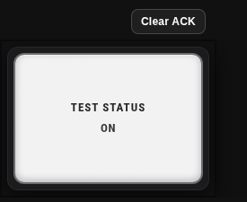

[](https://buymeacoffee.com/fallenhero)

# Annunciator Grid Card

[](#)
[](https://www.hacs.xyz/)
[](https://www.home-assistant.io/)
[](LICENSE)

An industrial-style annunciator panel for Home Assistant with a full visual editor, alarm acknowledgement, responsive panel sizing, paired lamps, groups, conditional rules, value transforms, change alerts, diagnostics, and persistent ACK support.

> **Safety notice:** This is a dashboard/monitoring component. It is not a certified life-safety, fire-alarm, process-safety, protective-relay, emergency-shutdown, or safety-instrumented-system component. Do not use it as the sole means of protecting people, equipment, or property.



## Highlights

- Full Home Assistant visual editor — normal use does not require YAML.
- Alarm, Status, Sensor, and Custom lamp intents.
- Truthy, state-list, string-match, and numeric-threshold conditions.
- TRIP / ALARM / WARN / STATUS severity system.
- Blink, Pulse, Wave, Throb, Heartbeat, Flash, or steady indications.
- Manual or automatic ACK rearm.
- Local-browser or compact persistent `input_text` ACK storage.
- Separate state/value-change alerts with timed or until-ACK behavior.
- Up to three display lines or lightweight templates.
- Celsius/Fahrenheit conversion, scale, offset, decimals, rounding, units, prefix, and suffix.
- Conditional rules with ordering, severity/color/effect override, and Force ON.
- Paired TOP/BOTTOM lamps that behave as one physical panel cell.
- Group headers and group ACK/Clear controls.
- Auto Fit, Fixed Size, and Horizontal Scroll panel sizing.
- Modern/Retro lamp styles and Plastic/Glass/Frosted/Smoked lens styles.
- Per-lamp color overrides plus severity-based appearance.
- Operator and Presentation modes.
- Lamp Test helper with steady-illumination or full-alert test modes.
- Numbered, searchable, paginated physical-cell navigator.
- Configuration validation/repair, Undo, diagnostics overlay, and copyable support package.
- Dynamic Masonry/Sections sizing and reduced-motion support.

## Installation

### HACS — custom repository

Until the repository is included in the default HACS catalog:

1. Open **HACS** in Home Assistant.
2. Open the HACS menu and choose **Custom repositories**.
3. Add the GitHub repository URL.
4. Select **Dashboard** as the category.
5. Open **Annunciator Grid Card** and choose **Download**.
6. Refresh the browser after installation/update.

After the repository is accepted into the default HACS catalog, search for **Annunciator Grid Card** directly in HACS.

### Manual installation

1. Download `annunciator-grid-card.js` from the latest GitHub Release.
2. Copy it to:

   ```text
   <config>/www/annunciator-grid-card.js
   ```

3. Add it as a Lovelace resource of type **JavaScript Module**:

   ```yaml
   resources:
     - url: /local/annunciator-grid-card.js
       type: module
   ```

4. Refresh Home Assistant.

## Add the card

Use the card picker or add:

```yaml
 type: custom:annunciator-grid-card
```

The visual editor provides **+ Lamp** and **+ Spacer** controls and exposes the complete configuration UI.

## Recommended optional helpers

The card works without helpers. For a shared/persistent operator panel, two optional helpers are useful:

```yaml
input_text:
  annunciator_ack_map:
    name: Annunciator ACK Map
    max: 255

input_boolean:
  annunciator_lamp_test:
    name: Annunciator Lamp Test
```

- Configure the text helper under **Panel Settings → Acknowledgement → Persistent input_text**.
- Configure the toggle under **Panel Settings → Advanced → Lamp test entity**.

## Quick alarm example

```yaml
 type: custom:annunciator-grid-card
 panel_id: main_panel
 columns: 4
 entities:
   - entity: binary_sensor.boiler_trip
     lamp_type: alarm
     severity: trip
     eval_mode: toggle
     alert_style: blink
     alert_when: on
     ack_rearm: auto
     primary_mode: name
     secondary_mode: state
```

For normal use, configure this through the visual editor instead of hand-editing YAML.

## Runtime interaction

In **Operator** mode:

- **Click/tap**: Home Assistant More Info.
- **Double-click**: acknowledge currently active alert channels.
- **Long press**: acknowledge on touch/pointer devices; moving/scrolling cancels the hold.
- **Keyboard Enter/Space**: acknowledge when the lamp is keyboard-focusable.

ACK is idempotent: ACKing an already-acknowledged lamp does not un-ACK it. Use the explicit **Clear ACK** controls to rearm manually.

In **Presentation** mode, acknowledgement is disabled. More Info can optionally remain enabled.

## Documentation

- [Complete User Guide](docs/USER_GUIDE.md)
- [Configuration Reference](docs/CONFIG_REFERENCE.md)
- [Examples](examples/)
- [Troubleshooting](docs/TROUBLESHOOTING.md)
- [Changelog](CHANGELOG.md)

## v1.0.0 status

v1.0.0 is the current first official release. See [VALIDATION.md](docs/VALIDATION.md).

## Support

When reporting a bug, please include:

1. Card version.
2. Home Assistant version.
3. Browser/device.
4. Whether installation is HACS or manual.
5. Relevant lamp/panel configuration.
6. Browser-console errors.
7. The card's **Copy diagnostic package** output when possible.

Use the included GitHub issue templates so reports contain the information needed to reproduce the problem.

## Development

No build step is required for the current single-file card. The distributable file is:

```text
dist/annunciator-grid-card.js
```

Run the local validation checks with:

```bash
npm test
```

This checks JavaScript syntax and release/static invariants. GitHub Actions additionally run the official HACS validation action.

## ☕ Support the Project

If you enjoy Annunciator Grid Card and would like to support its continued development, you can buy me a coffee:

[☕ Buy Me a Coffee](https://buymeacoffee.com/fallenhero)

Support is completely optional. Thank you for using and supporting the project!

## License

MIT — see [LICENSE](LICENSE).
